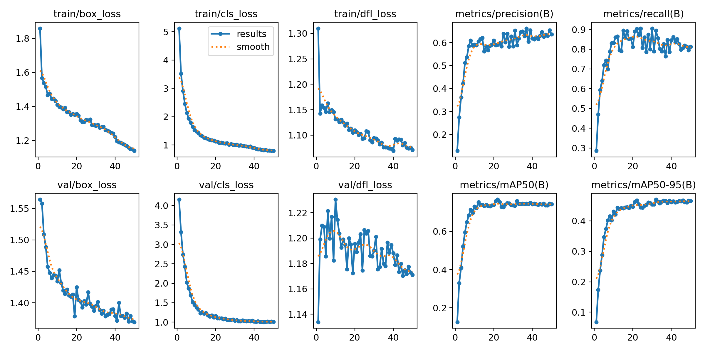
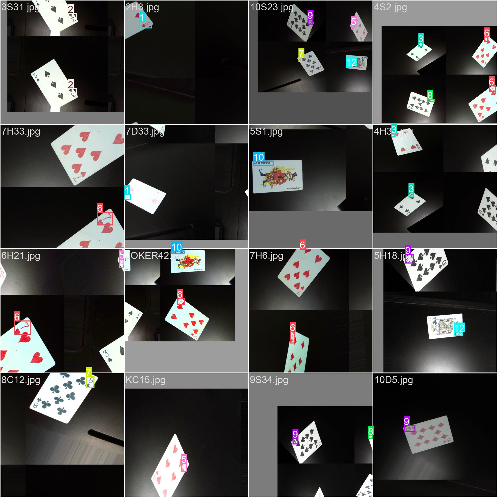
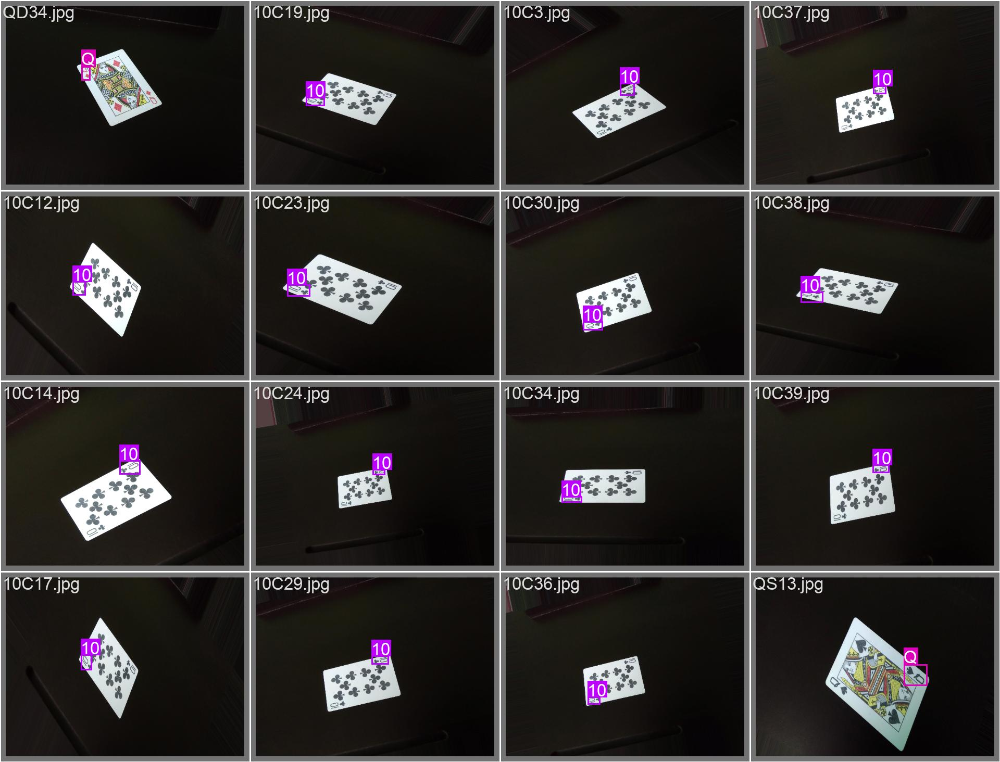

# HackJack — AI-Powered Blackjack Assistant

**HackJack** is a real-time, AI-driven blackjack assistant that combines computer vision, deep learning, and strategy optimization to analyze live gameplay and recommend optimal decisions. By leveraging a custom-trained **YOLOv8** object detection model and integrating intelligent decision-making, HackJack transforms a simple camera into a powerful blackjack analysis system.

---

## Overview
HackJack uses real-time video input to:
* **Detect and classify** playing cards instantly.
* **Track cards** across frames using persistent object tracking.
* **Maintain a live Hi-Lo card count** to gauge deck favorability.
* **Recommend optimal moves** (Hit, Stand, etc.) using the Gemini API.

This project demonstrates how modern AI systems bridge the gap between computer vision and decision intelligence in a high-stakes, real-world application.

---

## Key Features

### Real-Time Card Detection
* Powered by **YOLOv8** (You Only Look Once).
* Detects card rank and location in milliseconds.

### Custom-Trained AI Model
* Trained on a **~2GB dataset** of labeled playing cards.
* Over **3 million parameters**.
* **CPU Optimized:** Fully trained on a CPU over ~12 hours (achieving `cls_loss ≈ 0.79`).

### Intelligent Object Tracking
* Assigns persistent IDs to cards to **prevent double-counting**.
* Ensures the card count remains accurate even if the camera moves or the card is briefly obscured.

### Live Card Counting (Hi-Lo System)


| Card Range | Value |
| :--- | :--- |
| 2 – 6 | **+1** |
| 7 – 9 | **0** |
| 10 – A | **-1** |

### AI Move Recommendations
* Integrates the **Gemini API** for strategic analysis.
* Analyzes player hand vs. dealer up-card to suggest: **Hit, Stand, Double Down, or Split**.

---

## How It Works

1.  **Computer Vision:** The camera feed is processed frame-by-frame. YOLO predicts bounding boxes and class labels.
2.  **Object Tracking:** Each unique card is assigned an ID. Once a card is "committed" to the count, it isn't counted again.
3.  **Decision Engine:** The state of the table (Player Hand, Dealer Card, and Running Count) is passed to Gemini, which returns the mathematically optimal move.

---

## 🛠 Tech Stack

* **Python:** Computer vision, model training, and inference.
* **Ultralytics YOLOv8:** Object detection and tracking.
* **JavaScript/React:** Frontend logic and UI interaction.
* **Gemini API:** AI-based move recommendations.
* **OpenCV:** Video capture and frame rendering.
* **HTML/CSS:** Clean, responsive UI/UX.

---

## ⚙️ Setup & Installation

### 1. Clone the Repository
```bash
git clone [https://github.com/arnav-sutraway/BlackJack.git](https://github.com/arnav-sutraway/BlackJack.git)
cd BlackJack

## Setup & Installation
1. Clone the repository
```bash
   git clone https://github.com/arnav-sutraway/BlackJack.git
   cd BlackJack
```
2. Install Python dependencies
```bash
   pip install -r requirements.txt
```
3. Add your Gemini API key to your environment
```bash
   export GEMINI_API_KEY=your_api_key_here
```
4. Open `index.html` in your browser or run the local server

## Usage
- Start the game and point your camera at your Blackjack hand
- The AI will automatically recognize your cards and the dealer's up card
- Follow the recommended action: **Hit**, **Stand**, **Double Down**, etc.

## Contributors
- [@arnav-sutraway](https://github.com/arnav-sutraway)
- [@TarunIsCOde](https://github.com/TarunIsCOde)
- [@rajprian123-bit](https://github.com/rajprian123-bit)
- [@Shayan-kam](https://github.com/Shayan-kam)

## Results



